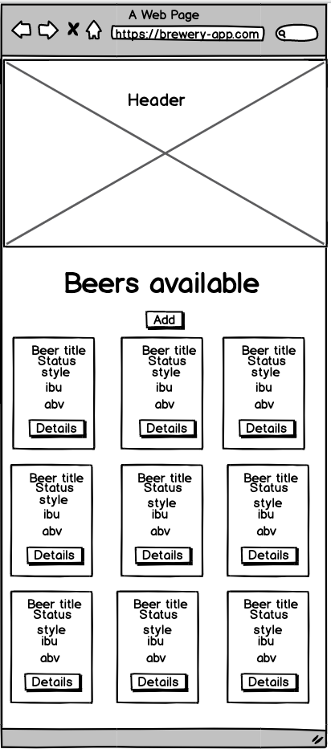
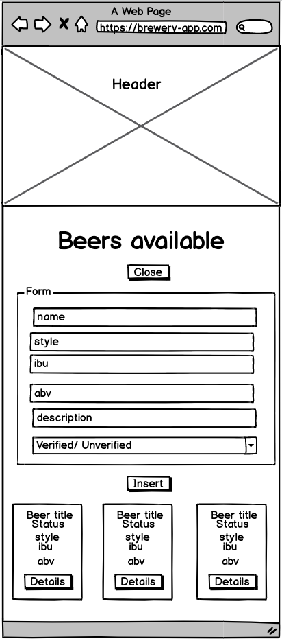
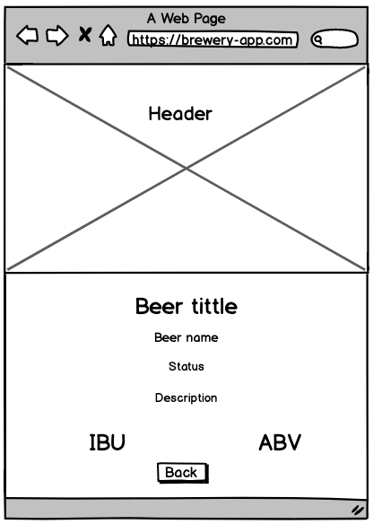
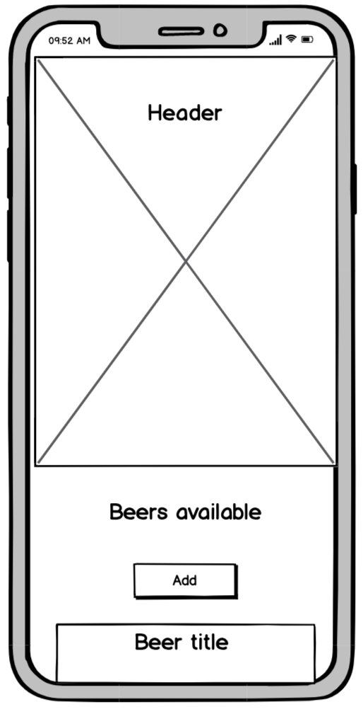
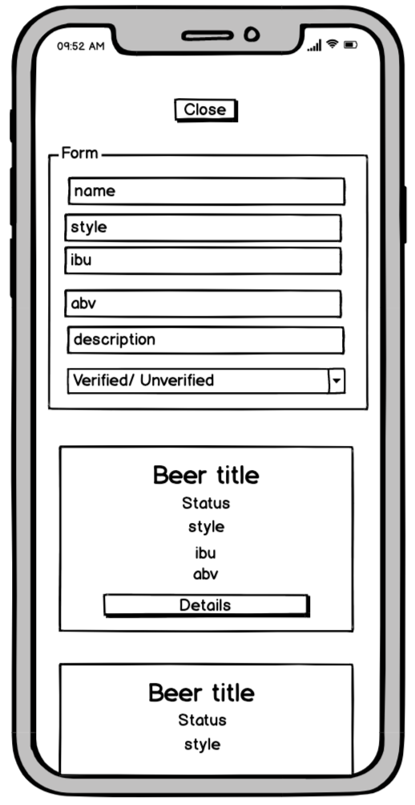
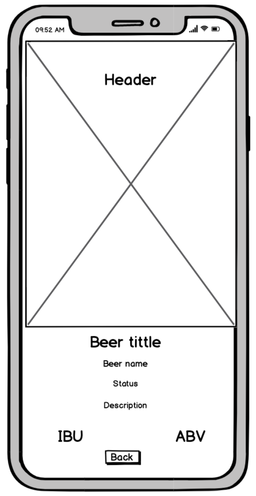

This project was bootstrapped with [Create React App](https://github.com/facebook/create-react-app).

# Brewery App

This app renders the beer cellar of a certain brewery. In this particular case, I've picked the famous Guinness Brewery.

This app does not have an API, so it makes usage of fake data. To achieve that, I took advantage of the [BreweryDB](https://brewerydb.com) sandbox. The main reason for that is the great amount of data provided by the API, so we don't have to generate our own.

To access the data you must generate a free API key at [BreweryDB](https://brewerydb.com) and include it at `src/services/api.js` or a `.env` file.

You can pick another brewery to be rendered by changing the ID in the API request at:

```
src/services/api.js
```

at the line:

```
const breweryID = INSERT_BREWERY_ID;
```

## Usage

Clone or download this repo. Then navigate to the folder:

### `cd brewery-app`

Install dependencies by running:

### `npm install` or `yarn`

To run the application:

### `npm start or yarn start`

Runs the app in the development mode.<br />
Open [http://localhost:3000](http://localhost:3000) to view it in the browser.

The page will reload if you make edits.<br />
You will also see any lint errors in the console.

---
## Wireframes

### Desktop
  
### Mobile
 


## Overview

| Features       |                                           Description                                           |
| -------------- | :---------------------------------------------------------------------------------------------: |
| Axios          |                      Promise based HTTP client for the browser and node.js                      |
| CORS support   |                  Via [cors-anywhere](https://github.com/Rob--W/cors-anywhere)                   |
| react-spinners | A collection of loading [spinners](https://www.npmjs.com/package/react-spinners) with React.js. |
| React-Router   |          Declarative [routing](https://www.npmjs.com/package/react-router) for React.           |

## Considerations

### Context API

The Context API provides a very straight forward way to pass data through the component tree without having to pass props down manually at every level.

You can find all the helper functions and the state at

```
src/context.js
```

### React Hooks

According to [Sophie Alpert](https://github.com/sophiebits) at React Conf 2008:

> Sophie Alpert said at React Conf 2018 Class are very confusing and annoying to understand for both > Human and Machine

React Hooks allow us to use state and React lifecycle features without using `class`

If you want to create a new component that uses Context, first `Import` the context:

```
import {BeerContext} from '../../context';
```

Then import the `useContext` hook

```
import React, {useContext} from 'react';
```

then you can destructure and use the available data and functions:
e.g:

```
let {generateSlug} = useContext(BeerContext);
```

### React Router

This app uses React Router as a dependence for navigation. By using React Router we can create client-side routing for a single-page web application without the page refreshing as the user navigates on.
